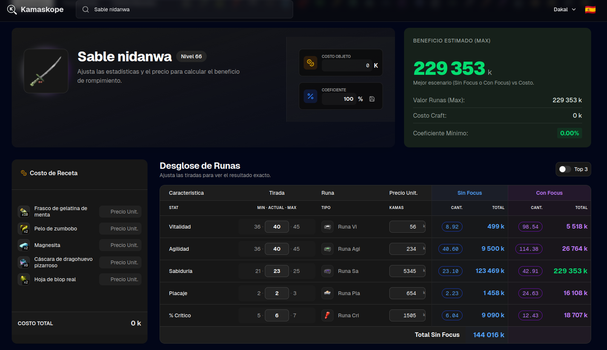
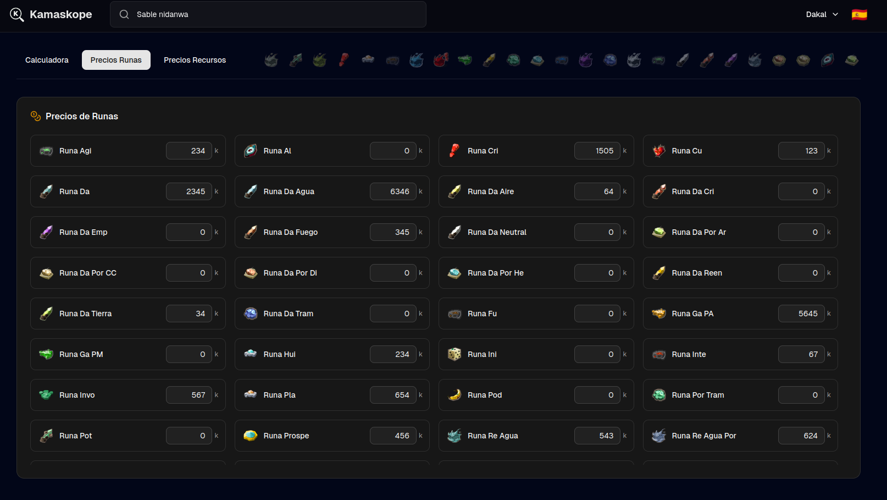
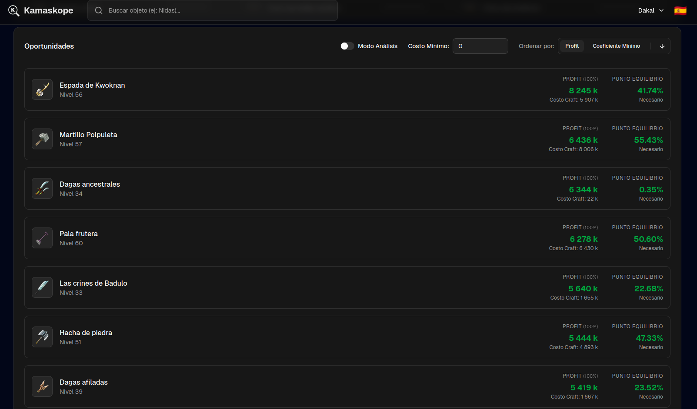

# 🛡️ Dofus Crushing Calculator (Unity 3.4)


> **Profitability calculator and rune management for the new era of Dofus Unity.**

Live App: https://kamaskope.icksir.com

This project is a comprehensive tool for the forging and crushing system. It allows calculating the profitability of breaking objects to obtain runes, managing real-time resource prices, searching for profitable recipes, and optimizing the game's economy.

---

## 📸 Screenshots

Here you can see how the application looks in operation.

### Calculator

*Overview of current profitabilities and prices.*

### Rune Prices

*Detail of rune prices.*

### Opportunities

*Profit opportunities*

---

## 🏗️ Project Architecture

Microservices architecture containerized with Docker for isolation and scalability.

### Main Components

- **Frontend**: Interface with **Next.js** and **React**. Handles UI and API calls.
- **Backend**: REST API with **FastAPI**. Business logic, OCR and DB connection.
- **Database**: **PostgreSQL** for prices, histories and configurations.

### Data Flow

1. Requests arrive at Nginx, which routes to Frontend (`/`) or Backend (`/api/*`).
2. Backend processes logic and queries PostgreSQL.
3. Responses return via Nginx with security headers.

### Docker Infrastructure

- **Containers**: Frontend, Backend, DB and Nginx.
- **Networks**: `web_network` (external), `default` (internal).
- **Volumes**: `postgres_data` for persistence.
- **Configuration**: Environment variables in `.env`.

## 🚀 Installation and Deployment

**Remember to start a database and instantiate the .env file**

Run:

```Bash
docker compose up -d --build
```

## 📄 License

Distributed under the MIT license. See LICENSE for more information.